Primero creamos un web y ejecutamos una instancia de una imagen con apache y php

```bash
sudo docker run -d --name web -p 8080:80 -v /home/pablo/Documentos:/var/www/html php:apache
```

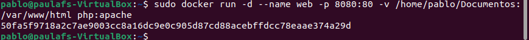

Creamos un contenedor que se llame bbdd que ejecute una instancia de la imagen mariadb

```bash
sudo docker run -d --name bbdd -p 3306:3306 -e MARIADB_ROOT_PASSWORD=root -e MARIADB_DATABASE=prueba -e MARIADB_USER=invitado -e MARIADB_PASSWORD=invitado mariadb
```

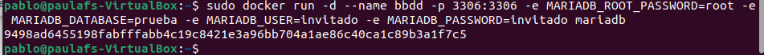

Captura de pantalla y documento que desde el navegador muestre el fichero index.html 

En esta imagen se ve el codigo html para montar la pagina

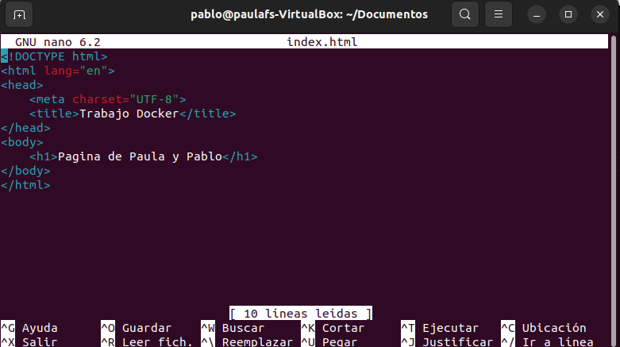

En esta imagen se muestra como se ve la pagina en un navegador

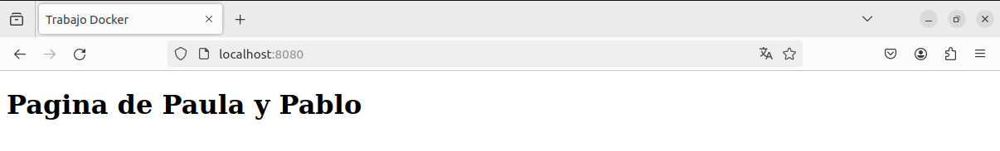

Captura de pantalla y documento que desde un navegador muestre la salida del script mes.php 

Codigo del php.png

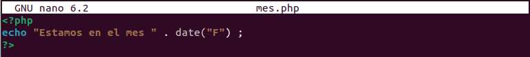

Vista de la pagina mes.php

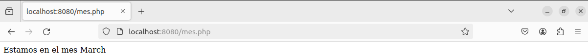

Captura de pantalla y documento donde se vea el tamaño del contenedor al crear los dos ficheros

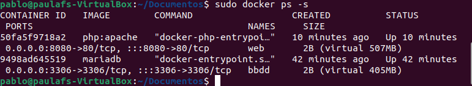

Captura de pantalla y documento donde desde un cliente de base de datos (instalado en tu ordenador, por ejemplo dbeaver ) se pueda observar que hemos podido conectarnos al servidor de base de datos con el usuario creado y que se ha creado la base de datos prueba (show databases). El acceso se debe realizar desde el ordenador que tenéis instalado docker, no hay que acceder desde dentro del contenedor, es decir, no usar docker exec

Seleccionamos que deseamos conectarnos a una base de MariaDB

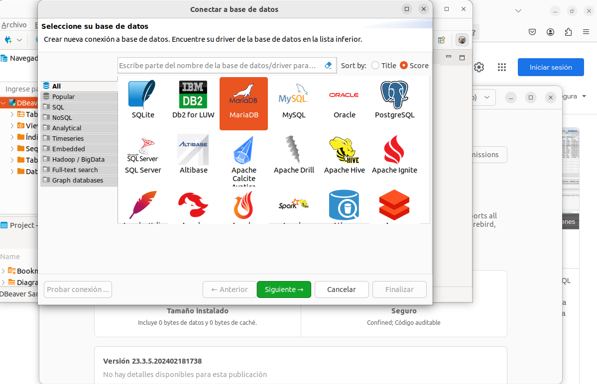

Configuramos la conexion a la base de datos

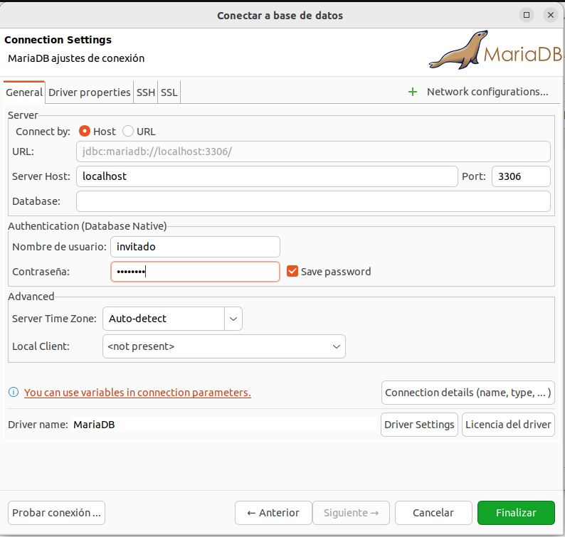

Y asi se veria la base de datos prueba

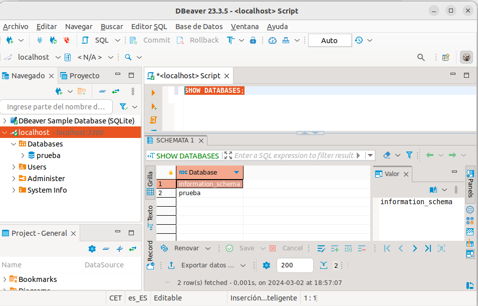

Captura de pantalla y documento donde se comprueba que no se puede borrar la imagen mariadb mientras el contenedor bbdd está creado.

```bash
Sudo docker rmi mariadb
```

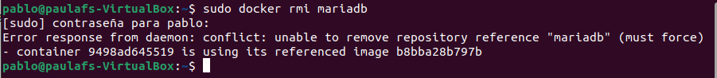