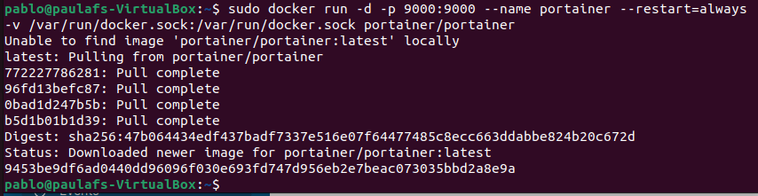
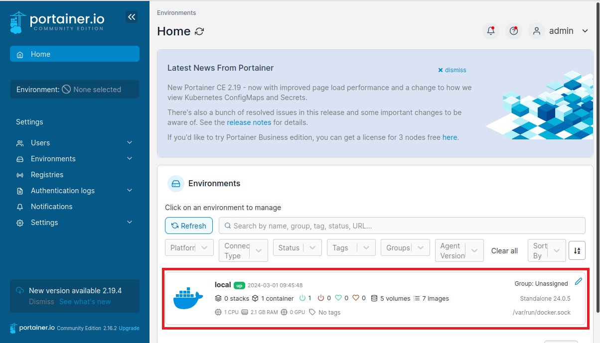
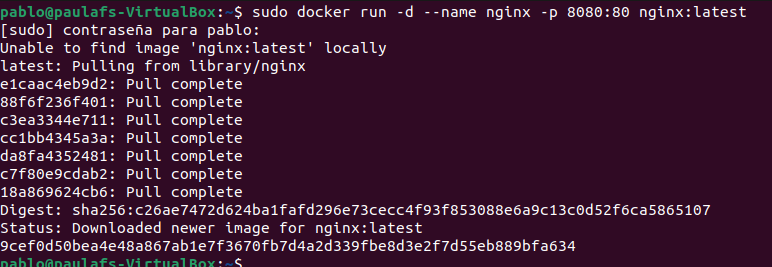
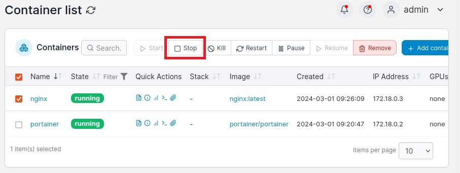
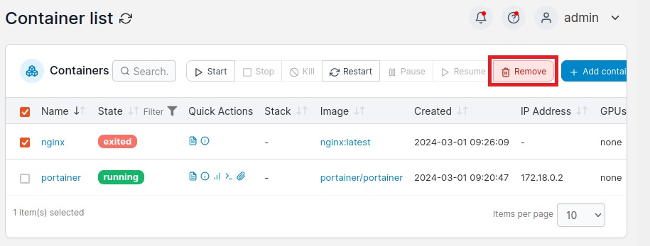
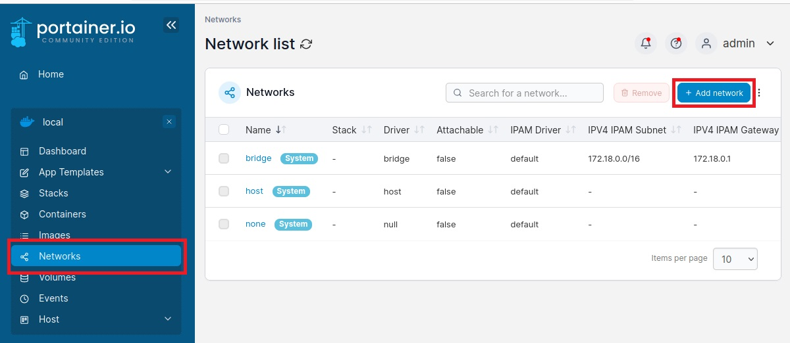
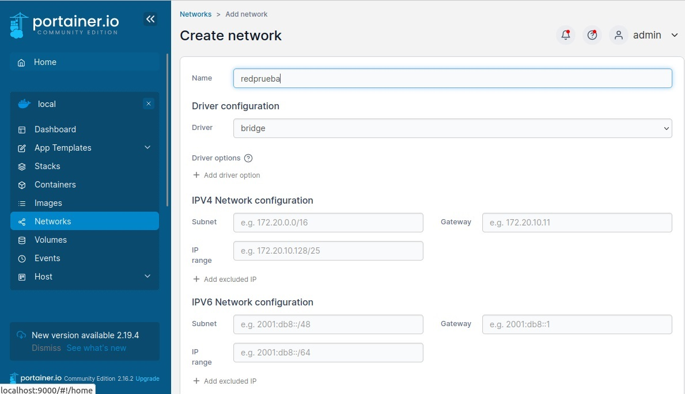
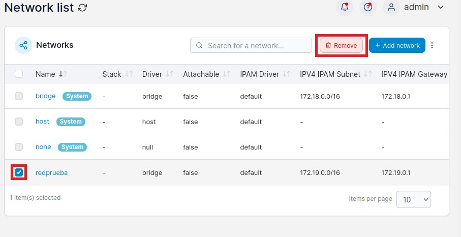
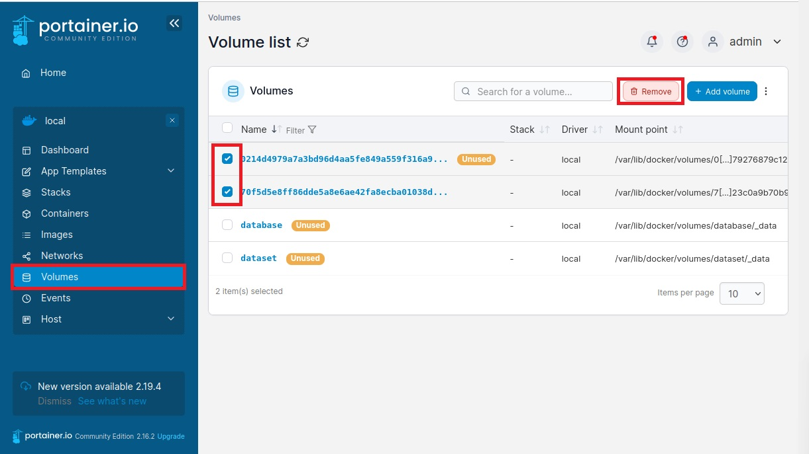
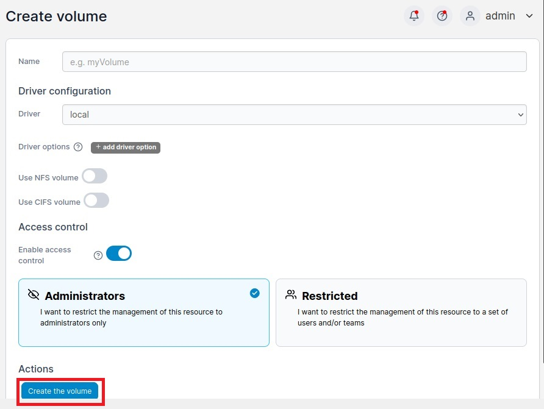

Descargamos la imagen y creamos un contenedor llamado portainer

```bash
sudo docker run -d -p 9000:9000 --name portainer --restart=always -v /var/run/docker.sock:/var/run/docker.sock portainer/portainer
```



En este caso estaremos lanzando portainer en el puerto 9000, podremos acceder a su interfaz en el navegador web y yendo a localhost:9000. La primera vez has de crear una cuenta, tras ello verás una interfaz similar a la siguiente




Tendrás que hacer clic en el entorno para comenzar a administrarlo. Primero administramos los containers, para ello utilizo una imagen de nginx:

```bash
sudo docker run -d --name nginx -p 8080:80 nginx:latest
```



La cual podemos parar



O borrar



Ahora comenzaremos con la administración de las redes, para ello en el menú de la izquierda haremos clic en networks y crearemos una red para trabajar con ella 





Con la nueva red de prueba creada podemos probar a borrarla, donde te saldrá un aviso de si estas seguro de que desea borrar y tras confirmar se borrará la red seleccionada.



Por ultimo administraremos los volúmenes accediendo a Volumes desde el menú de la izquierda, una de las cosas que puedes hacer es seleccionar volúmenes y tratar de borrarlos o crear nuevos de ellos.



