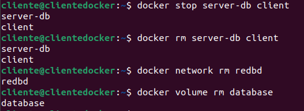

1. Captura de pantalla y documento donde se vean los contenedores creados y en ejecución.

    ```bash
    docker network create -d web
    docker run -d
    docker run -d
    ```

    

2. Captura de pantalla y documento donde se vea el acceso a la BD a través de la interfaz web de Adminer.

    

3. Captura de pantalla y documento donde se vea la creación de una BD con la interfaz web Adminer.

    

4. Captura de pantalla y documento donde se entre a la consola del servidor web en modo texto y se compruebe que se ha creado la BD.

    ```bash
    docker exec -it contenedor bash
    ```

    

5. Borrar los contenedores la red y los volúmenes utilizados

    ```bash
    docker stop contenedor contenedor
    docker rm contenedor contenedor
    docker volume rm volume 
    docker network rm network 
    ```

    