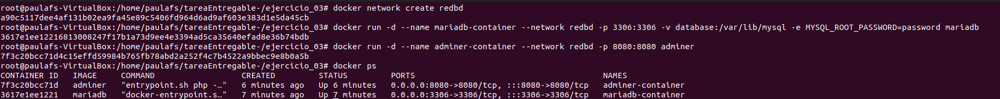
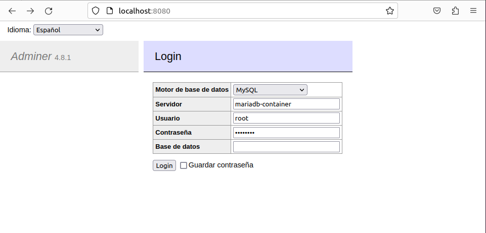
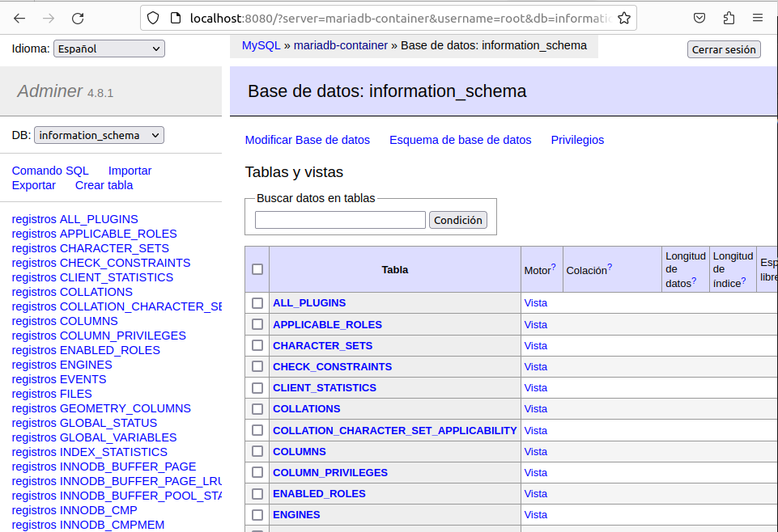
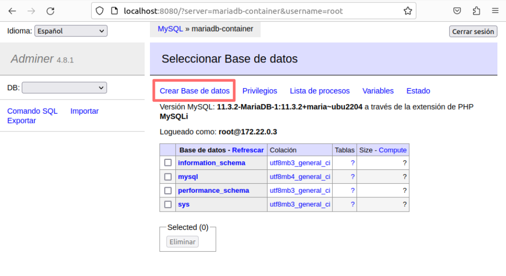
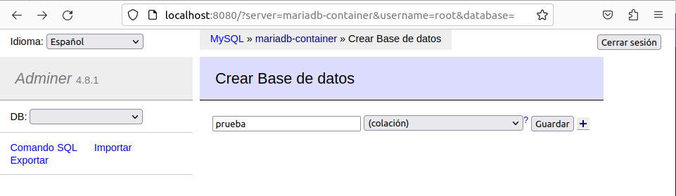
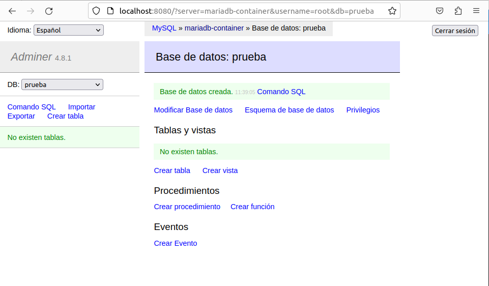
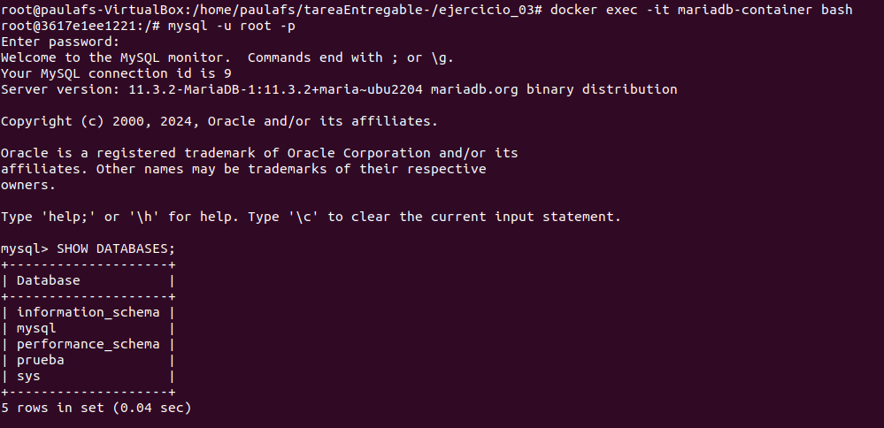
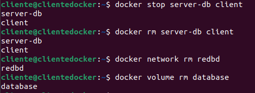

1. Captura de pantalla y documento donde se vean los contenedores creados y en ejecución.

    ```bash
    docker network create -d redbd

    docker run -d --name mariadb-container --network redbd -p 3306:3306 -v database:/var/lib/mysql -e MYSQL_ROOT_PASSWORD=password mariadb

    docker run -d --name adminer-container --network redbd -p 8080:8080 adminer
    ```

    

2. Captura de pantalla y documento donde se vea el acceso a la BD a través de la interfaz web de Adminer.

    

    

3. Captura de pantalla y documento donde se vea la creación de una BD con la interfaz web Adminer.

    Hacemos click sobre el botón de "Crear base de datos"

    

    Escribimos el nombre que deseamos darla a la base de datos y hacemos click sobre el botón de guardar.

    

    

4. Captura de pantalla y documento donde se entre a la consola del servidor web en modo texto y se compruebe que se ha creado la BD.

    ```bash
    docker exec -it mariadb-container bash

    ```

    

5. Borrar los contenedores la red y los volúmenes utilizados

    ```bash
    docker stop contenedor contenedor
    docker rm contenedor contenedor
    docker volume rm volume 
    docker network rm network 
    ```

    