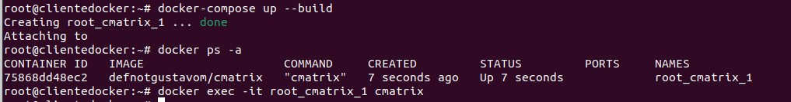
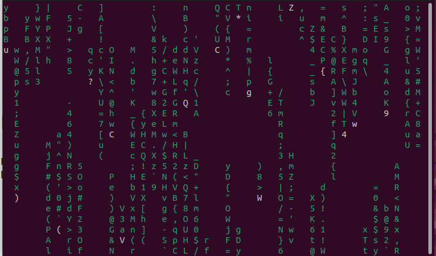

1. Captura de pantalla y documento donde se vea el fichero `docker-compose.yaml`.

    ```docker
    services:
        cmatrix:
            image: defnotgustavom/cmatrix
            tty: true
            stdin_open: true
            network_mode: none
            read_only: true
            cap_drop:
                - ALL
            logging:
                driver: none
    ```

    Puede encontrar el archivo haciendo click [aquí](./files/docker-compose.yml).

2. Captura de pantalla y documento donde se vea la aplicación funcionando. Se valorará conseguir el efecto *Greenrain*.

    ```bash
    docker-compose up
    docker exec -it cmatrix-container cmatrix 
    ```

    

    Resultado:

    

3. Explicar brevemente cómo funciona esta aplicación.
    
    Para hacer que funcione la *Greenrain* debemos lanzar el archivo docker compose y a continuación comprobar el nombre del contenedor.

    Después se puede ejecutar lanzando el comando cmatrix del contenedor. Se pueden utilizar parámetros para establecer el color (-C [color]), los retardos de la actualización de pantalla (-u [0.10]) y si quieres que las letras estén en negrita (-B) o no (-n).

    Si no se envia ningún parámetro por defecto se lanzará la lluvia con letras verdes, sin negrita y con un retardo de 4.
