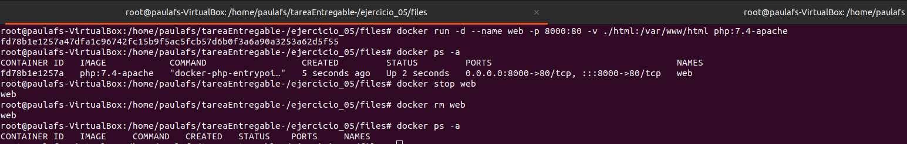
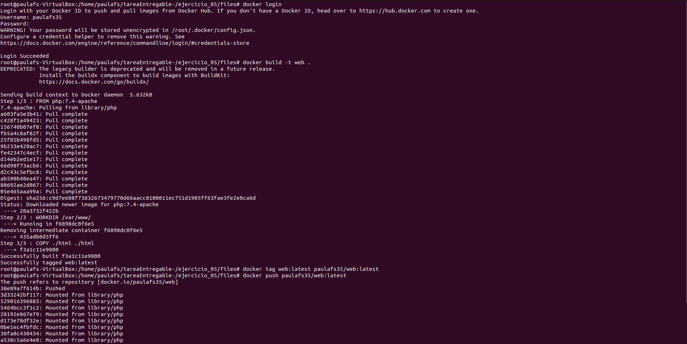
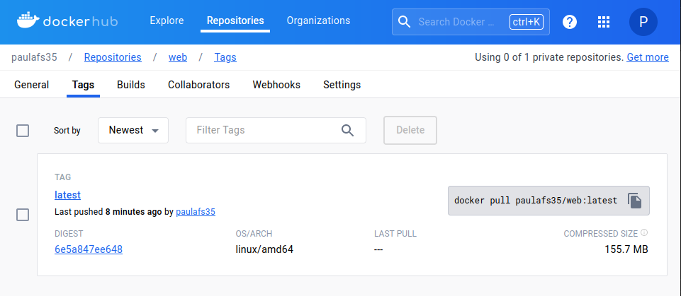
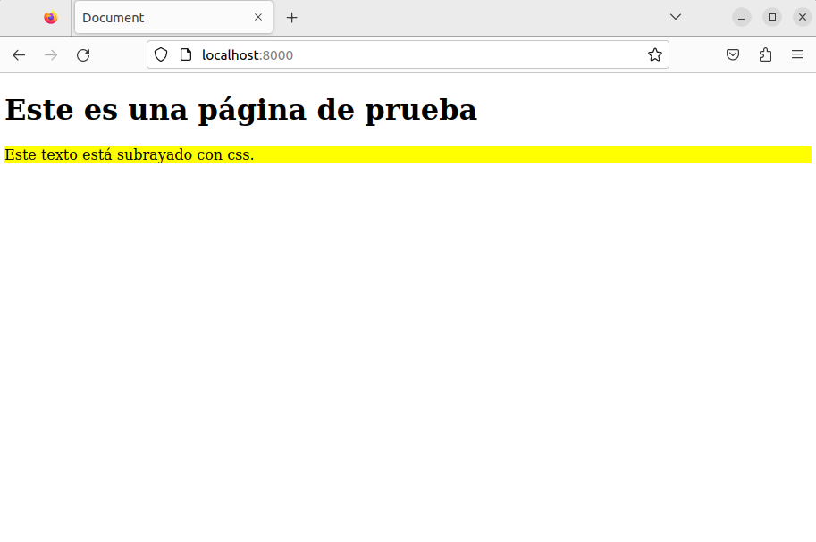
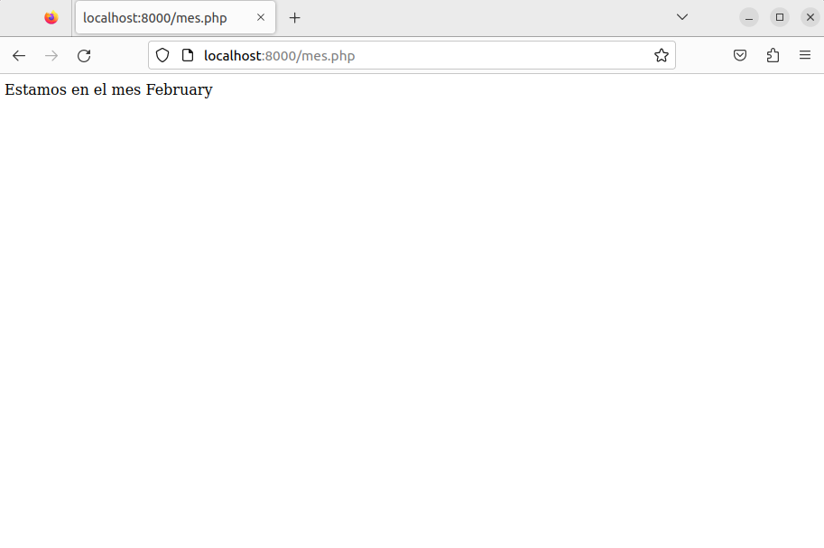

1. Creación inicial del contenedor - documenta los pasos hasta el borrado del mismo

    Primero debemos crear el contenedor, para ello crearemos una carpeta con los archivos que queremos que vayan dentro de la carpeta de html y la enlazamos como bind-mount utilizando -v.

    Para enlazar el puerto debemos añadir la variable - con el puerto_hots:puerto_contenedor.

    Para borrar el contenedor primero debemos pararlo y después borrarlo.

    ```bash
    docker run -d --name web -p 8000:80 -v ./html:/var/www/html php:7.4-apache
    docker stop web
    docker rm web
    ```

    

2. Bloque de código con el Dockerfile

    ```docker
    FROM php:7.4-apache
    WORKDIR /var/www/
    COPY ./html ./html
    ```

3. Captura de pantalla y documento donde se vea el comando que crea la nueva imagen.

    ```bash
    docker login

    docker build -t web .
    docker tag web:latest paulafs35/web:latest

    docker push paulafs35/web:latest
    ```
    

4. Captura de pantalla y documento donde se vea la imagen subida a tu cuenta de Docker Hub.

    

5. Captura de pantalla y documento donde se vea la bajada de la imagen - **por parte de otra persona del grupo** - y la creación de un contenedor.

6. Captura de pantalla y documento donde se ve el acceso al navegador con el sitio servido

    
    